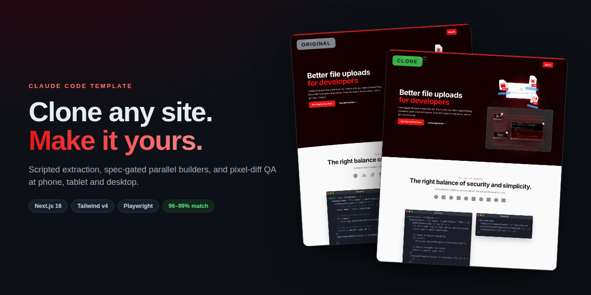

# ai-site-cloner



**Point AI at any website. Get a pixel-accurate, working Next.js clone back — measured, not eyeballed.**

One command. `/clone-website` turns Claude Code (or Cursor, Copilot, Gemini CLI — 12 tools supported) into a full cloning pipeline: it crawls the site, extracts every computed style with scripted Playwright measurement, generates auditable component specs, dispatches parallel builder agents in git worktrees, and loops a scored pixel-diff QA at phone/tablet/desktop widths until every section clears 95%. Then `/restyle` swaps in your own brand — colors, fonts, logo, copy — without touching the cloned layout.

Screenshot-to-code tools guess. This one measures.

## Proof: plausible.io, cloned


**99.71% average pixel match** across 9 sections × 3 viewports, scored by pixelmatch against the live site — **6 of 9 sections hit a perfect 100% on every viewport**, nothing below 97.5%. And it's not a screenshot of a screenshot: the clone is a working app with the nav dropdowns, the mobile menu overlay, and the 9-tier pricing slider with its monthly/yearly toggle and recomputing prices — a clean, typed, componentized codebase you can actually maintain.

| Section | PC | iPad | Phone |  | Section | PC | iPad | Phone |
|---|---|---|---|---|---|---|---|---|
| hero | 100% | 100% | 100% |  | story | 99.98% | 99.97% | 100% |
| dashboard | 100% | 100% | 100% |  | nav | 99.2% | 98.8% | 100% |
| features | 100% | 100% | 100% |  | cta | 99.6% | 99.3% | 100% |
| testimonials | 100% | 100% | 100% |  | footer | 100% | 97.7% | 100% |
| pricing | 100% | 100% | 97.5% |  |  |  |  |  |

Full-page and phone side-by-sides, the data file, and how the run went: [`examples/plausible/`](examples/plausible/)

**Second example:** [`examples/uploadthing/`](examples/uploadthing/) — its hero artwork is painted on a `<canvas>`, normally unclonable since there's no DOM to copy. The pipeline records it via `canvas.captureStream()` and embeds a looping video, so the clone keeps the artwork *and* its motion.

## Fast. Accurate. Cheap on tokens.

**Fast.** Recon of an entire page — design tokens, every asset downloaded, computed-style walks of every section, responsive measurements, and screenshots at all three viewports — is **one command and three page loads (~15 seconds)**. Builders run in parallel git worktrees, so five sections build in the time of one. QA opens with **one whole-page diff per viewport instead of dozens of per-section diffs** — on a good clone the entire QA phase is a handful of page loads — and the original site's screenshots are cached, so fix iterations only re-render your clone. Interrupted? `manifest.mjs resume` prints exactly where you were and the next command to run.

**Accurate.** The AI never invents a value. Font sizes, padding, colors, real column counts, hover states, transition durations — everything a builder uses was measured from the live page by a script. A linter blocks incomplete specs from ever reaching a builder, and the pixelmatch score decides when a section is done: 95% per section per viewport, no exceptions, no "looks right to me." When a diff fails, `compare.mjs` walks both live DOMs and names the exact CSS properties that differ — so a fix is one targeted edit, not a guessing loop.

**Cheap on tokens.** Cloning with an agent is a token problem before it's anything else — the naive approach pastes screenshots and raw DOM into context and burns six figures of tokens guessing. Here the agent never reads a raw page. The scripts write compact artifacts, and the agent reads only the interface:

- Section walks ship in a **compact format** (style dictionary + inheritance pruning) — the plausible.io extraction dropped from 889KB to 445KB, and nobody reads the JSON anyway: `resolve-walk.mjs` answers questions about any single node
- Interaction captures store **only what changed**: the pricing toggle's capture is 2.9KB, down from 368KB of before/after DOM dumps
- Specs are **generated from the JSON** — the agent writes ~10 judgment lines per section instead of transcribing hundreds of values, and each builder receives one 2–4KB spec, not the site
- Screenshots are judged at **640px review size** (~half the bytes); full-res exists only for pixelmatch and builders
- On Tailwind-style sites the extraction stores the **cleaned source markup** — plausible's hero is 1.7KB of HTML that *is* the spec
- QA returns **numbers, not images**: match scores and a 10-band breakdown naming the failing y-range; an image gets opened only when something fails

Net effect: the agent-facing surface of a full plausible-sized run fits in about half a megabyte of artifacts, and specs + scores are the only parts an agent routinely reads.

## Quick Start

1. Create your own repository from this template (**Use this template** on GitHub), then clone it.
2. Install:
   ```bash
   npm install   # Chromium auto-installs on the first extraction run (or: npm run setup)
   ```
3. Start Claude Code (Chrome integration recommended for interaction discovery):
   ```bash
   claude --chrome
   ```
4. Clone a site:
   ```
   /clone-website https://example.com
   ```
5. Make it yours: fill in `BRAND.md`, then:
   ```
   /restyle
   ```

## How it works

**Crawl → Recon → Foundation → Sections → Assembly → QA loop** — six phases, one command, resumable at any point.

| | Phase | What happens |
|:---:|---|---|
| 🕸️ | **0 · Crawl** | Sitemap + nav discovery. You confirm the page list — that's the only question it asks. |
| 📐 | **1 · Recon** | One command per page: design tokens, every asset downloaded, computed-style walks, responsive measurements at 390/768/1440px, screenshots, interaction sweep. Three page loads, ~15 seconds. |
| 🎨 | **2 · Foundation** | Fonts, color tokens, TypeScript types, extracted SVG icons, shared header/footer. |
| 🧱 | **3 · Sections** | Spec scaffolded from the extraction JSON → AI fills the judgment blocks → lint gate → parallel builder agents in git worktrees → merge. |
| 🧩 | **4 · Assembly** | One route per page, content wired from `src/data/*.ts` to components. |
| ✅ | **5 · QA loop** | Whole-page pixel triage first; only sections in failing bands get individual diffs. Every section must clear **95% × 3 viewports** — the score decides, not vibes. |

The AI never invents a value. Every number a builder uses — font sizes, padding, colors, column counts, hover states, transition durations — comes from a script that measured the live page. Specs are generated from that JSON, a linter blocks incomplete ones, and the pixel score decides when a section is done.

## Why this beats screenshot-to-code

| Problem with "look at a screenshot and code it" | What happens here instead |
|---|---|
| AI guesses CSS values from pixels | `scripts/extract/section.mjs` — full `getComputedStyle()` DOM walk, exact values (stored compact; `resolve-walk.mjs` reads any node) |
| Responsive behavior guessed from desktop | `scripts/extract/responsive.mjs` — real column counts and font steps measured at 390/768/1440px |
| Only the default state gets cloned | `--state` captures diff the DOM before/after every click/hover/scroll — dropdowns, toggles, tab panels, with the appeared nodes and their styles |
| "Looks close enough" QA | `scripts/diff.mjs` — pixel-diff score per section per viewport, 95% to pass; `--triage` diffs the whole page first and touches only sections in failing bands |
| QA says WHERE but not WHAT | `scripts/compare.mjs` — walks original + clone, prints the differing computed properties ordered by visual impact |
| AI mis-transcribes values into specs | `scripts/spec-scaffold.mjs` — mechanical spec sections generated straight from the extraction JSON (Tailwind sites quote the source markup itself) |
| Incomplete specs slip through | `scripts/lint-spec.mjs` — mechanical completeness gate before any builder runs |
| Long runs die and restart from zero | `docs/research/manifest.json` — scripts self-report their stage transitions; `manifest.mjs resume` prints the exact next commands |
| Single-page only | `scripts/extract/crawl.mjs` — sitemap + nav discovery, shared header/footer extracted once |
| `<canvas>` artwork is unclonable | `scripts/extract/canvas.mjs` — records it with `captureStream()`, embeds a looping video |
| Clone is a dead-end copy | Content lives in `src/data/*.ts` + the `/restyle` skill = rebrand without breaking layout |

## Scripts

All plain Playwright — run standalone, no MCP needed:

```bash
node scripts/extract/page.mjs <url>                    # ONE-SHOT recon: tokens, css, assets, responsive,
                                                       #   section walks + every screenshot — 3 page loads, ~15s
node scripts/extract/crawl.mjs <url> [--max 25]        # discover pages
node scripts/extract/page.mjs --rename section-3=hero  # rename auto-detected sections in place (no browser)
node scripts/extract/section.mjs <url> --selector "x" --state hover:".card"   # hover/scroll/click state diffs
node scripts/extract/probe.mjs <url> --selector "x"    # per-viewport value table for specs
node scripts/spec-scaffold.mjs --route / --all         # generate the mechanical spec sections from the
                                                       #   extraction JSON; agent fills judgment blocks only
node scripts/resolve-walk.mjs <sections.json> --node 0.2.1   # resolved styles for any walk node (walks are
                                                       #   stored compact: style dict + inheritance pruning)
node scripts/extract/canvas.mjs <url>                  # capture <canvas> artwork as video/PNG
node scripts/extract/tokens.mjs / css.mjs / assets.mjs / responsive.mjs / screenshot.mjs   # single-purpose re-runs
node scripts/diff.mjs --original <url> --clone <url> --route / --triage --viewport all
                                                       # scored pixel diff QA: whole-page first, per-section
                                                       #   only where bands fail; 10-band breakdown names
                                                       #   WHERE it mismatches; scores land in the manifest
node scripts/compare.mjs --original <url> --clone <url> --selector "x"   # WHAT differs on a failing section:
                                                       #   computed-property table, geometry > typography > color
node scripts/lint-spec.mjs docs/research/components    # spec completeness gate
node scripts/manifest.mjs resume                       # one-screen digest: stage table + exact next commands
```

## Supported agents

The two skills are written once in `.claude/skills/` and synced to every other tool's native format (`node scripts/sync-skills.mjs`; CI fails if generated configs go stale):

**Claude Code** (native) · **Cursor** · **Windsurf** · **GitHub Copilot** · **Gemini CLI** · **Amazon Q** · **Codex** · **Cline** · **Continue** · **opencode** · **Augment** · **Aider** — plus a generic [`AGENTS.md`](AGENTS.md) that most other tools pick up automatically.

The extraction scripts are plain Node CLIs, so any agent can run them. Tools without subagent/worktree support build sections sequentially from the same lint-gated specs — every quality gate still applies.

## Docker

```bash
docker compose up dev    # dev server on :3000, Playwright preinstalled (extraction works in-container)
docker compose up app    # production: slim standalone build of the finished clone
```

## Stack

Next.js 16 (App Router, React 19, TS strict) · Tailwind CSS v4 · shadcn/ui · Playwright + pixelmatch (dev)

Requires Node 22+ (auto via `.nvmrc`).

## Intended Use

Platform migration of sites you own · recovering lost source code · learning how production sites are built.

**Not for** phishing, impersonation, or passing off someone else's design as your own. Check a site's terms before cloning it. The example clones in this repo (plausible.io, uploadthing.com) are technical demonstrations — don't republish anyone's brand.

## License

MIT
