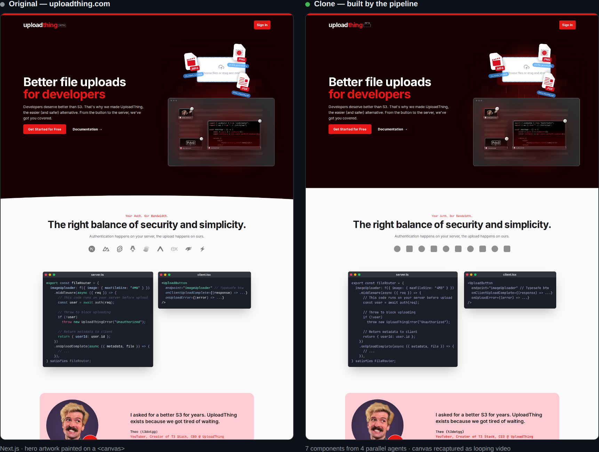

# site-cloner


Clone any multi-page website into a clean Next.js codebase with Claude Code — then rebrand it as your own.

Point it at a URL. `/clone-website` crawls the site, measures everything with scripted Playwright extraction (no eyeballing), writes auditable component specs, dispatches parallel builder agents in git worktrees, and loops a scored pixel-diff QA at phone/iPad/PC widths until every section passes. Then `/restyle` swaps in your brand — colors, fonts, logo, copy — without touching the cloned layout.

## Quick Start

1. Create your own repository from this template (**Use this template** on GitHub), then clone it.
2. Install:
   ```bash
   npm install   # Chromium auto-installs on the first extraction run (or: npm run setup)
   ```
3. Start Claude Code (Chrome integration recommended for interaction discovery):
   ```bash
   claude --chrome
   ```
4. Clone a site:
   ```
   /clone-website https://example.com
   ```
5. Make it yours: fill in `BRAND.md`, then:
   ```
   /restyle
   ```

## What's Better Than Eyeball Cloning

| Problem | Solution here |
|---|---|
| Agent guesses CSS values from screenshots | `scripts/extract/section.mjs` — full `getComputedStyle()` DOM walk, exact values |
| Responsive behavior guessed from desktop | `scripts/extract/responsive.mjs` — measures real column counts at 390/768/1440px |
| "Looks close enough" QA | `scripts/diff.mjs` — pixel-diff score per section per viewport; 95% threshold to pass |
| Agent mis-transcribes values into specs | `scripts/spec-scaffold.mjs` — mechanical spec sections generated straight from the extraction JSON |
| Incomplete specs slip through | `scripts/lint-spec.mjs` — mechanical completeness gate before any builder runs |
| Long runs die and restart from zero | `docs/research/manifest.json` — every section's stage tracked; runs resume where they stopped |
| Single-page only | `scripts/extract/crawl.mjs` — sitemap + nav discovery, shared header/footer extracted once |
| Clone is a dead-end copy | Content in `src/data/*.ts` + `/restyle` skill = rebrand without breaking layout |

## Example

[`examples/uploadthing/`](examples/uploadthing/) is a real end-to-end run against **uploadthing.com** — side-by-side screenshots, the per-viewport score table (96–99.8% per section), and the tooling bugs that run exposed and fixed.



Its hero illustration is painted on a `<canvas>` — normally unclonable, since there's no DOM to copy. The pipeline records it through `canvas.captureStream()` and embeds a looping video, so the clone keeps the artwork *and* its motion.

## Pipeline

```
Phase 0  Crawl        sitemap + nav discovery → you confirm the page list
Phase 1  Recon        tokens, assets, screenshots, responsive measurements, interaction sweep
Phase 2  Foundation   fonts, color tokens, types, extracted SVG icons, shared header/footer
Phase 3  Sections     extract → spec file → lint gate → parallel builders in worktrees → merge
Phase 4  Assembly     one route per page, data wired to components
Phase 5  QA loop      pixel-diff every section × 3 viewports until ≥95% match
```

## Scripts

All plain Playwright — run standalone, no MCP needed:

```bash
node scripts/extract/page.mjs <url>                    # ONE-SHOT recon: tokens, css, assets, responsive,
                                                       #   section walks + every screenshot — 3 page loads, ~15s
node scripts/extract/crawl.mjs <url> [--max 25]        # discover pages
node scripts/extract/page.mjs --rename section-3=hero  # rename auto-detected sections in place (no browser)
node scripts/extract/section.mjs <url> --selector "x" --state hover:".card"   # hover/scroll/click state diffs
node scripts/extract/probe.mjs <url> --selector "x"    # per-viewport value table for specs
node scripts/spec-scaffold.mjs --route / --all         # generate the mechanical spec sections from the
                                                       #   extraction JSON; agent fills judgment blocks only
node scripts/resolve-walk.mjs <sections.json> --node 0.2.1   # resolved styles for any walk node (walks are
                                                       #   stored compact: style dict + inheritance pruning)
node scripts/extract/canvas.mjs <url>                  # capture <canvas> artwork as video/PNG
node scripts/extract/tokens.mjs / css.mjs / assets.mjs / responsive.mjs / screenshot.mjs   # single-purpose re-runs
node scripts/diff.mjs --original <url> --clone <url> --route / --triage --viewport all
                                                       # scored pixel diff QA: whole-page first, per-section
                                                       #   only where bands fail; 10-band breakdown names
                                                       #   WHERE it mismatches; scores land in the manifest
node scripts/compare.mjs --original <url> --clone <url> --selector "x"   # WHAT differs on a failing section:
                                                       #   computed-property table, geometry > typography > color
node scripts/lint-spec.mjs docs/research/components    # spec completeness gate
node scripts/manifest.mjs resume                       # one-screen digest: stage table + exact next commands
```

## Supported agents

The two skills are written once in `.claude/skills/` and synced to every other tool's native format (`node scripts/sync-skills.mjs`; CI fails if generated configs go stale):

**Claude Code** (native) · **Cursor** · **Windsurf** · **GitHub Copilot** · **Gemini CLI** · **Amazon Q** · **Codex** · **Cline** · **Continue** · **opencode** · **Augment** · **Aider** — plus a generic [`AGENTS.md`](AGENTS.md) that most other tools pick up automatically.

The extraction scripts are plain Node CLIs, so any agent can run them. Tools without subagent/worktree support build sections sequentially from the same lint-gated specs — every quality gate still applies.

## Docker

```bash
docker compose up dev    # dev server on :3000, Playwright preinstalled (extraction works in-container)
docker compose up app    # production: slim standalone build of the finished clone
```

## Stack

Next.js 16 (App Router, React 19, TS strict) · Tailwind CSS v4 · shadcn/ui · Playwright + pixelmatch (dev)

Requires Node 22+ (auto via `.nvmrc`).

## Intended Use

Platform migration of sites you own · recovering lost source code · learning how production sites are built.

**Not for** phishing, impersonation, or passing off someone else's design as your own. Check a site's terms before cloning it.

## License

MIT
