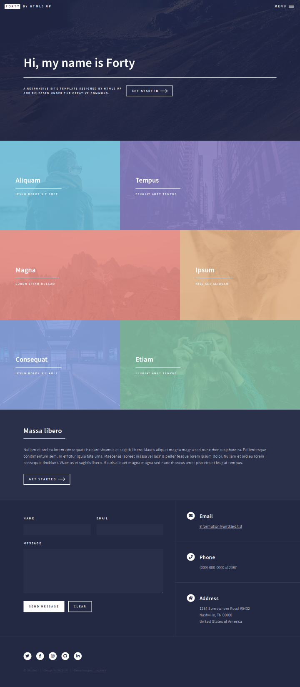
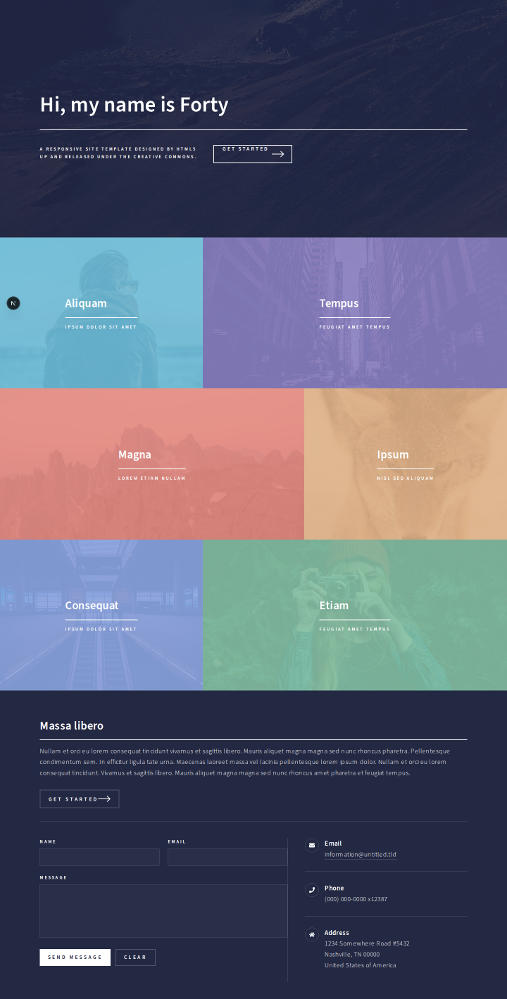

# Example: cloning HTML5 UP "Forty"

A real end-to-end run of `/clone-website` against **https://html5up.net/uploads/demos/forty/** — used to validate the pipeline and shipped here as a reference for what good output looks like.

> Forty is by [HTML5 UP](https://html5up.net), released under [CC BY 3.0](https://html5up.net/license). It's used here as a legally clean cloning target. Demo images from [Unsplash](https://unsplash.com).

| Original | Clone |
|---|---|
|  |  |

## Result

One page, 5 components, 4 measured sections × 3 viewports:

| Section | PC (1440) | iPad (768) | Phone (390) |
|---|---|---|---|
| banner | **98.2%** | **97.1%** | 93.4% |
| tiles | **95.2%** | **98.5%** | **96.1%** |
| cta | **99.0%** | **95.1%** | 91.3% |
| contact | **96.0%** | 93.5% | 92.8% |

Sections were built by four builder agents running in parallel, each getting only its spec inline.

## The specs

[`specs/`](specs/) holds the four spec files that drove the build — real output of Phase 3, all passing `lint-spec.mjs`. Use them as a format reference when writing your own.

## What this run taught the template

Every one of these became a fix in the tooling:

| Finding | Fix |
|---|---|
| Site served at apex domain, all links pointed at `www.` — crawler found 1 page instead of 251 | `crawl.mjs` compares hostnames modulo `www.` and follows sitemap-index files |
| `body > #wrapper > #main > section` nesting hid every real section | `responsive.mjs` walks down through non-semantic wrappers |
| A 44px phone header fell under the height floor and vanished | floor lowered to 40px |
| A 6-tile collection was split into 6 "sections" | repeated same-tag children stay ONE section → one component + data array |
| The hero's dark overlay, every heading underline, and the button arrows are `::before`/`::after` — the walker was blind to all of them | `section.mjs` now extracts pseudo-element styles |
| The Next.js dev badge rendered into QA screenshots and cost real score points | `devIndicators: false` in `next.config.ts` |
| Specs said "iPad: same as desktop" → builders guessed → 98% at PC but 91% at phone | `probe.mjs` added; `lint-spec.mjs` now rejects vague responsive sections |
| Builders found the hand-written specs wrong in ~10 places by checking the extraction JSON | builder prompts now carry an explicit "JSON is ground truth" rule |

## Honest limits

- **Phone scores plateau around 91–93% on text-heavy sections.** The target uses Source Sans Pro; Google Fonts serves Source Sans 3. Slightly different metrics → different wrap points → unavoidable pixel drift. The layout is correct; the pixels can't be.
- Scores are per-section pixel diffs, not a claim of perfection. Read the diff images in `docs/research/qa/` before trusting any number.

## Reproducing

```bash
npm install && npx playwright install chromium
claude --chrome
/clone-website https://html5up.net/uploads/demos/forty/
```
