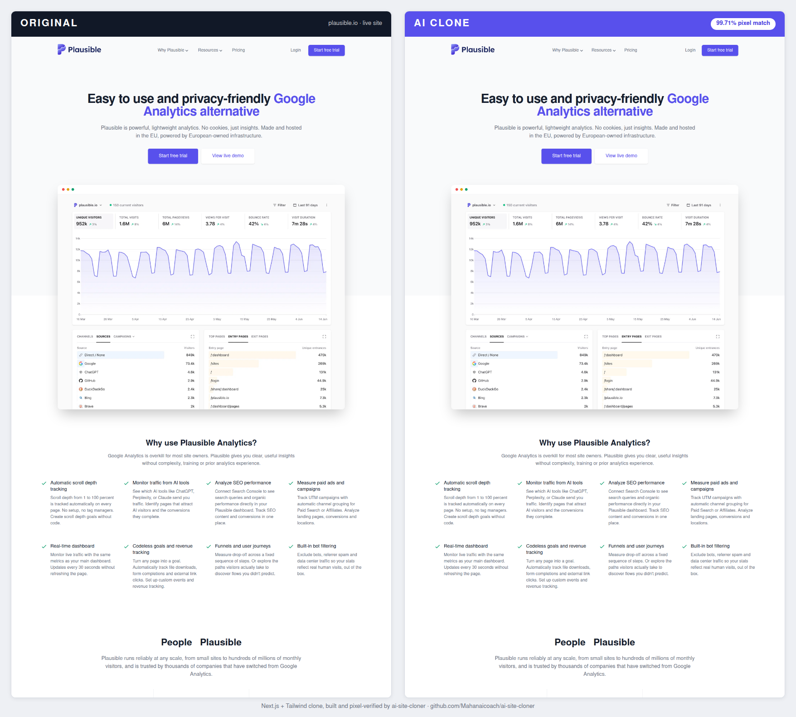

# Example: cloning plausible.io

A real end-to-end run of `/clone-website` against **https://plausible.io** — the full homepage, 9 sections, rebuilt as a clean Next.js + Tailwind codebase by parallel builder agents working from machine-generated specs.

> Plausible Analytics is a real product by Plausible Insights OÜ. Cloned here as a technical exercise to demonstrate pixel fidelity only. Don't republish someone else's brand.



## Result

| Section | PC (1440) | iPad (768) | Phone (390) |
|---|---|---|---|
| nav | **99.2%** | **98.8%** | **100%** |
| hero | **100%** | **100%** | **100%** |
| dashboard | **100%** | **100%** | **100%** |
| features | **100%** | **100%** | **100%** |
| testimonials | **100%** | **100%** | **100%** |
| story | **99.98%** | **99.97%** | **100%** |
| pricing | **100%** | **100%** | **97.5%** |
| cta | **99.6%** | **99.3%** | **100%** |
| footer | **100%** | **97.7%** | **100%** |

Six of nine sections hit a pixel-perfect **100% on every viewport**. Scores are pixelmatch percentages, measured by `scripts/diff.mjs` against the live site — not eyeballed.

- [`comparison-full.png`](comparison-full.png) — the entire 6,400px page side by side
- [`comparison-phone.png`](comparison-phone.png) — the 390px phone rendering side by side

## What made it hard (and what the pipeline did about it)

**It's not a static page.** The clone reproduces the behavior, not just the pixels:

- **Nav dropdowns** ("Why Plausible", "Resources") with icon grids — captured by `section.mjs --state click:…`, which diffs the DOM before/after and reports the appeared panel with its styles
- **Mobile menu overlay** at 390px — a conditionally-rendered tree the structural differ lists under `added`
- **The pricing widget** — a 9-position traffic slider, a monthly/yearly toggle with "2 months free" badge, and per-plan prices that recompute from both controls. The extraction recorded every state; the builder implemented it as a small state machine
- **Hover states** on CTAs and testimonial cards — from `css.json`'s `interactiveStates` checklist plus captured hover diffs

**Tailwind detection.** plausible.io fingerprints at 98.5% utility-class tokens, so the extraction stores each section's cleaned markup alongside the computed-style walk — the class list *is* the spec (`## Source Markup` in the generated spec files).

**Content is data.** All copy lives in [`data-home.ts.txt`](data-home.ts.txt) (the clone's `src/data/home.ts`) — 210 lines of typed content feeding 9 prop-driven components. Swap the data, keep the layout: that's what `/restyle` builds on.

## How it ran

```bash
/clone-website https://plausible.io
```

Phase by phase: crawl → one `page.mjs` call (tokens, assets, responsive signatures, computed-style walks, all screenshots — 3 page loads) → state captures for every dropdown/toggle/hover → specs scaffolded from the JSON and judgment-filled by the agent → lint gate → parallel builder agents in worktrees → merge → scored pixel-diff QA against the live site until every section cleared 95%.

This run was also the measurement bed for the v0.3.0 efficiency overhaul: the artifact sizes, page-load counts, and QA-iteration costs measured here drove the compact walk format, diff-only state captures, whole-page QA triage, and `compare.mjs`.
